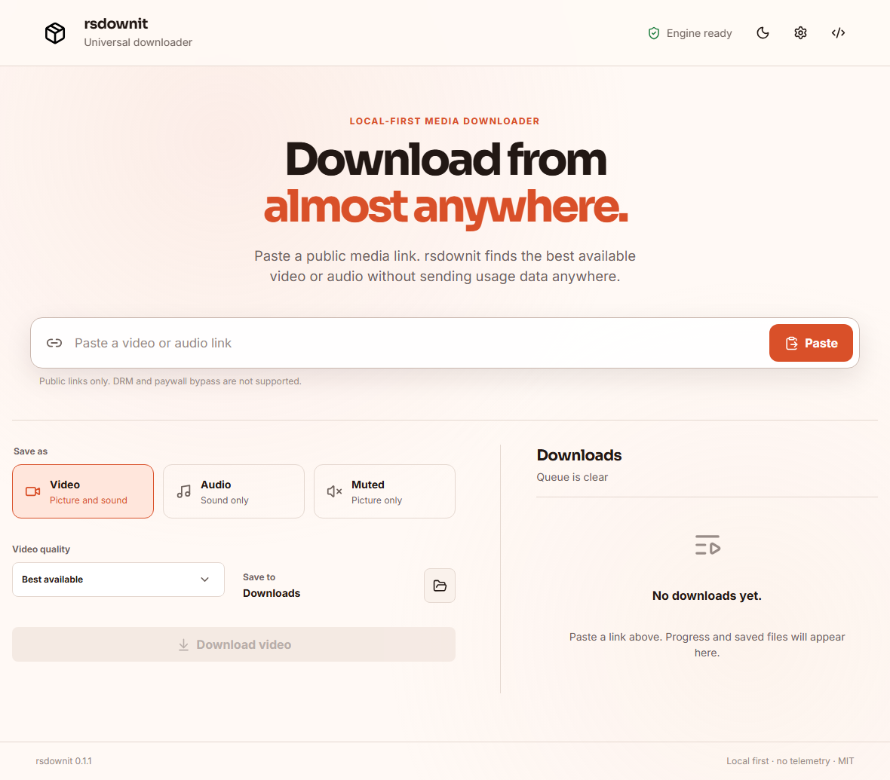

# rsdownit

[](https://github.com/RlxChap2/rsdownit/actions/workflows/build.yml)

rsdownit is an open-source desktop app for saving public video and audio. It provides a native download queue, format and quality controls, local history, and a folder picker without requiring a command line.



Windows 10 and 11 are the current release targets. The Tauri and Rust foundation is portable, but managed tool installation and release packaging for macOS and Linux are still in development.

## Features

- Video, muted-video, and audio-only downloads.
- Best available quality or a video cap from 2160p to 360p.
- Native audio, MP3, M4A, Opus, and WAV output, with optional bitrate selection.
- Download progress, speed, ETA, cancellation, retry, and local history.
- A native output-folder picker. Existing files are never overwritten.
- Optional browser cookies for media the user is authorized to access.
- Optional self-hosted Cobalt fallback. Community instances remain disabled by default.
- Light and dark themes with responsive desktop and tablet layouts.
- No telemetry.
- Signed in-app updates and update checks for managed yt-dlp and FFmpeg tools.

The desktop app checks the signed GitHub release feed at startup. When a newer version is available, it shows the installed and available versions and waits for the user to choose **Update now** or **Later**. Updates are installed only after Tauri verifies the release signature.

No downloader can guarantee permanent support for every website. Extractors, authentication requirements, and site markup change over time. rsdownit does not bypass DRM, paywalls, or access controls.

## How links are resolved

rsdownit tries each allowed method in this order:

| Order | Resolver | Role |
| --- | --- | --- |
| 1 | Direct stream | Saves a public media file without launching another process |
| 2 | yt-dlp | Handles supported sites locally, including HLS and DASH streams |
| 3 | Self-hosted Cobalt | Uses an endpoint configured by the user |
| 4 | Community Cobalt | Optional third-party fallback that requires explicit consent |
| 5 | HTML probe | Searches public page metadata and media elements for a direct source |

Managed yt-dlp and Windows FFmpeg binaries are downloaded from publisher URLs and checked against published SHA-256 values before installation. A system copy on `PATH` can also be used, but the app identifies it as system-provided rather than publisher-verified.

## Privacy and security

- Downloads stay local unless an API fallback is enabled.
- API tokens remain in memory and are not written to `settings.json`.
- Browser-cookie access is opt-in and is passed only to the local yt-dlp process.
- Media URLs containing embedded credentials, local hostnames, or private IP ranges are rejected.
- Direct downloads reject executable and shortcut filename extensions.
- The Tauri window uses a restrictive Content Security Policy and a small capability set.

Security reports should follow the private process in [SECURITY.md](SECURITY.md).

## Download and verify a release

Windows builds are published on the [Releases page](https://github.com/RlxChap2/rsdownit/releases). Each release includes `SHA256SUMS.txt` and displays the same checksums in its release notes. Signed updater builds also include the updater manifest and signature.

Compare a downloaded file with the published checksum:

```powershell
Get-FileHash .\rsdownit.exe -Algorithm SHA256
Get-Content .\SHA256SUMS.txt
```

The repository also includes a verification helper:

```powershell
.\scripts\verify-release.ps1 -Manifest .\SHA256SUMS.txt -File .\rsdownit.exe
```

GitHub build provenance can be checked with the GitHub CLI:

```powershell
gh attestation verify .\rsdownit.exe --repo RlxChap2/rsdownit
```

A checksum confirms file identity, while the attestation links the file to this repository's GitHub Actions workflow. Production releases should also use an Authenticode certificate so Windows can verify the publisher.

## Build from source

Requirements:

- Node.js 22.13 or newer; CI uses Node.js 24.
- pnpm 11.5.1.
- Stable Rust.
- Microsoft C++ Build Tools and WebView2 on Windows.

```powershell
pnpm install --frozen-lockfile
pnpm tauri dev
pnpm tauri build
```

Run the same core checks used in CI:

```powershell
pnpm version:check
pnpm test
pnpm test:smoke
pnpm build
pnpm audit --prod

Set-Location src-tauri
cargo fmt --check
cargo clippy --all-targets --all-features -- -D warnings
cargo test
```

Three network integration tests are ignored by default because they download real files. Run them explicitly when that network activity is acceptable:

```powershell
Set-Location src-tauri
cargo test -- --ignored
```

## Publishing a release

The version command updates `package.json`, Tauri configuration, `Cargo.toml`, and the rsdownit entry in `Cargo.lock` together:

```powershell
pnpm version:set 0.2.0
pnpm version:check
```

Commit the version change, then create and push a matching annotated tag:

```powershell
git add package.json src-tauri/Cargo.toml src-tauri/Cargo.lock src-tauri/tauri.conf.json
git commit -m "release: v0.2.0"
git tag -a v0.2.0 -m "rsdownit v0.2.0"
git push origin main
git push origin v0.2.0
```

The release workflow checks the version and tag before starting tests or the Windows build. A valid tag triggers tests, dependency audits, the Windows build, configured signatures, SHA-256 generation, provenance attestation, and GitHub Release publication. A manual workflow run builds downloadable CI artifacts without publishing a release.

Updater signing uses the `TAURI_SIGNING_PRIVATE_KEY` and optional `TAURI_SIGNING_PRIVATE_KEY_PASSWORD` repository secrets. Windows Authenticode signing uses a base64-encoded PFX in `WINDOWS_CERTIFICATE` and its password in `WINDOWS_CERTIFICATE_PASSWORD`. Private keys and certificates must never be committed to the repository.

## Project layout

```text
src/app/                     App state and composition
src/components/              Shared layout and UI controls
src/features/downloads/      Download form, setup status, and history
src/features/settings/       Settings dialog
src/features/updates/        Signed update prompt
src/styles/                  Fonts, design tokens, and application styles
src-tauri/src/downloader.rs  Provider chain, progress, and cancellation
src-tauri/src/providers/     Direct, yt-dlp, and Cobalt adapters
src-tauri/src/security.rs    URL and filename policy
src-tauri/src/tools.rs       Tool discovery, download, and SHA-256 checks
scripts/version.mjs          Version synchronization and release-tag check
tests/ui-smoke.mjs           Desktop and responsive Playwright smoke test
```

## Contributing

Bug reports and focused pull requests are welcome. See [CONTRIBUTING.md](CONTRIBUTING.md) for the local checks and contribution guidelines.

## Legal

Download only material that may legally be saved. Website terms and copyright law still apply. rsdownit does not bypass DRM or paywalls.

## License

rsdownit is released under the [MIT License](LICENSE). Bundled and managed external tools retain their own licenses; see [THIRD_PARTY_NOTICES.md](THIRD_PARTY_NOTICES.md).
